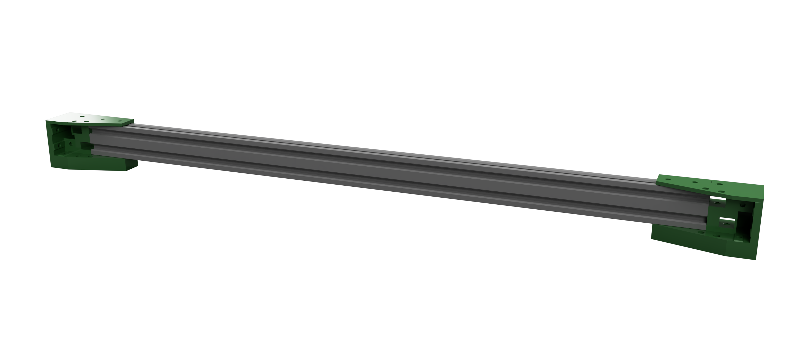
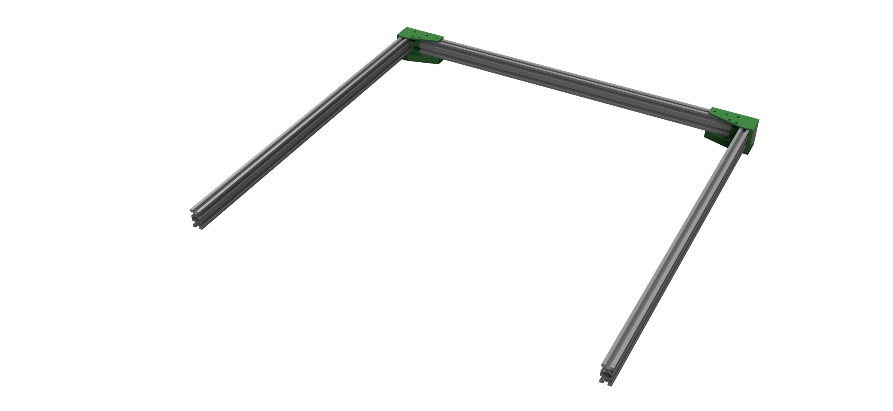
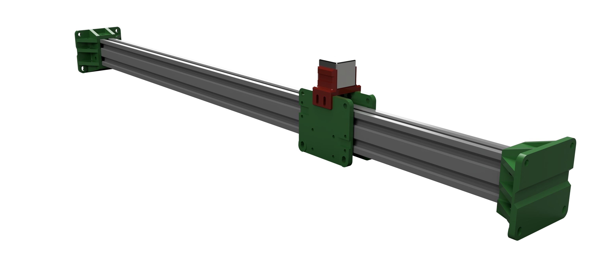
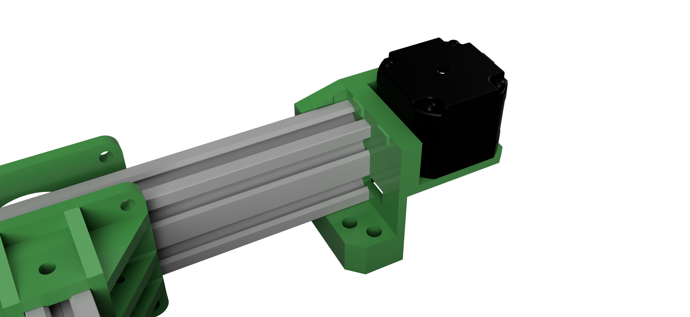
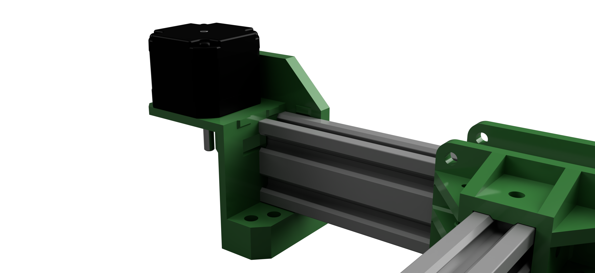
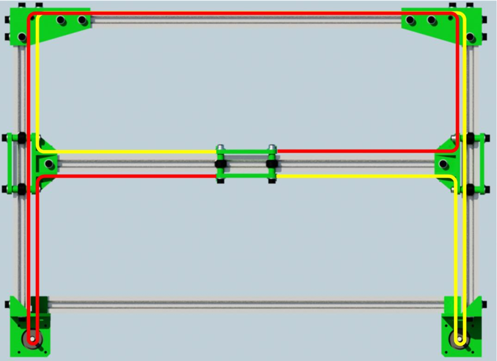

# Sand Table Build Guide

### Designed by Ravi Dudhagra ([@rdudhagra](https://github.com/rdudhagra))

This is a build guide for those who want to construct a table similar to mine. The end result will be a 3'x3' coffee table, 16" high.

## Prerequisites

While everything for the table itself is included in the BOM, a few tools are required (all should be available at a local makerspace):

- Drill and assorted drill bits (mostly small, but you'll need something around 1" for the power cord hole)
- Screwdriver with metric hex bits
- Pliers/wrench for holding nuts in place
- Hammer for the finishing nails (or a hard, heavy object)
- 3D Printer
- Soldering iron and solder (access to heat-shrink tubing is also nice)
- Saw capable of long, straight cuts, like a table saw/circular saw/large bandsaw
- Miter saw capable of 45 degree miters
- Some clamps (not required but extremely helpful for the glue-ups)
- **Proper safety gear**

## Bill Of Materials

See `sand_table_bom.pdf` or `sand_table_bom.xlsx` for a bill of materials. I put everything I could think of on the list...chances are that you have at least some of the items already, and the worst case is that you'll have a lot of extra parts for your next project!

## CAD Model

In case the below steps weren't clear, or if you want to modify the design yourself, you can find the CAD model of the entire table at https://a360.co/2QLgInO, and just the CoreXY gantry at https://a360.co/31KW79k.

## Building the actual table

Assembly of the table is straightforward; you only need basic woodworking skills and the knowledge (or someone else with the knowledge) of how to safely operate the power tools required.

See `Assembly Guide.pdf` for diagrams of all the cuts and the assembly.

### Board sizes to cut

1. Four 1x8 boards, 36 inches long, with the edges mitered at 45 degrees (the long side is 36"). The boards should form the walls of the table when put together.
2. A 1/2" plywood board, measuring 34.5" square
3. A 1/2" plywood board, measuring 33.875" square
4. Two plywood strips (cut from the underlayment plywood board in the BOM or another thin wood sheet), measuring 33.875" long and 2" high
5. Two plywood strips (cut from the underlayment plywood board in the BOM or another thin wood sheet), measuring 33.875" + 2 times the width of the wood sheet you're using, and 2" high
6. Four plywood strips, 36" long, 5" high, and mitered at 45 degrees

### Assembly (before paint)

1. Glue the four 1x8 boards together into a frame with the bottom board (the larger plywood square). This should form a shallow box with no top. If needed, finishing nails/clamps can be used to hold the parts together while drying.
2. Glue the top board (smaller plywood square) to the plywood strips (that are 2" high) to form another shallow box (more like a tray than a box). Make sure that seams are sealed with glue or something else, so that sand cannot go through the cracks and mess up the electronics.
3. Glue the remaining plywood strips (5" high) into a ring. Make sure that the strips are aligned vertically; this will reduce the amount of work you'll have to do later when sanding.
4. You can fill in any cracks with some wood filler or wood glue and then sand flat

### Sanding/Painting

I wanted to achieve a smooth, glossy black finish for my table. Here are the steps I took:

1. First, sand all surfaces smooth. I used 60/120 grit sandpaper on my sheet sander to get rid of bumps and level everything out, then worked my way up to 240 grit and then 400 grit on all surfaces.
2. I then used spray paint primer and laid a thick coat on all surfaces. I sanded everything at 400 grit until smooth (without sanding all the paint away), and added another coat of primer on all surfaces, and sanded again at 400 grit.
3. On surfaces that were not going to be seen when the table is assembled (like inside walls and the bottom, etc.), I stopped here. On outside surfaces, I applied coats of primer and wet-sanded consecutively at 800 and 1200 grits. At these higher grits, I sanded by hand rather than with the sheet sander.
4. Last, I applied coats of black glossy paint on all surfaces, and then applied a coat of clear-coat on the outside surfaces to protect the paint.

This process seems simple when written out, but take your time sanding, especially early-on, otherwise any defects will be seen on the final coats.

### Assembly (after paint)

1. Install the legs on the four corners of the table by drilling a hole for the center screw and then tightening a nut/washer from the inside. Take care to ensure that the legs are flush with the end of the table for a polished look.
2. Cut a hole for the power wire along one of the edges, near the left corner (see later in this guide for some context on where the hole should go).

## Building the gantry

The gantry design was heavily influenced by the [D-Bot CoreXY 3D Printer](https://www.thingiverse.com/thing:1001065). Essentially, I took the top gantry of the 3D printer and modified it to work with the sand table. I highly recommend looking at their build guide (a copy can be found here as well) for how to assemble the gantry, as it is quite similar and is documented far-better.

1. Print all parts in the `STLs` folder. The number at the beginning of each part's filename indicates how many you will need. These parts should be printed solid, or at least with a lot of shells.
2. You will need to make two cuts in your VSlot extrusions. These lengths assume that your two extrusions are 1500mm long. The first extrusion should be cut into two pieces of equal length, and will be referred to as the _side rails_. The second extrusion needs to be cut into two pieces such that one of the pieces is 25mm longer than the other. The longer piece will be the _hbar rail_, and the shorter piece will be the _back rail_. Be sure to account for the thickness of your saw blade when you cut your pieces.
3. Install the bearings on the rear idlers and hbar end idlers, per the D-bot build guide pdf pages 11-12.
4. Attach the two rear idlers to the back rail using M5 screws and M5 square nuts (and washers). See a diagram of this on page 13 of the D-bot build guide pdf, although note that this part has been modified for the sand-table. Note that the screws are not shown in the renderings.
   
5. Attach the side rails to the two rear idlers as shown:
   
6. Attach the hbar idlers and print carriage to the hbar rail, and mount the hbar rail onto the current assembly. Pay close attention to the orientation of the idlers on the rail (whether the bearings are on the top/bottom, etc). Refer to the D-bot build guide pdf pages 39, 43-46 on how to do this. The belt clamps can also be mounted to the print carriage loosely at this step (see page 38 for how to do so). Note that the print carriage has been modified to hold a magnet instead of an 3d printer extruder. The magnet clamp (in red) can be attached using short M3 screws, washers and nuts (on the inside). A groove exists so that if the magnet is loose, a zip tie can be clamped around it to hold it in place (some electrical tape around the magnet helps increase the grip). I suggest that the magnet **should not** be installed until the very end, as it is quite powerful and could hurt someone.

- Note: the wheel spacers found in the STLs folder differ from the D-Bot buid guide - the spacers for this project have an added lip to minimize drag on the roller bearings. This has the effect of making the wheel spacers directional and they should be installed such that the lip is touching the bearing.


 7. You can now install the two motor mounts on the ends of the side rails. Make sure to install the stepper dampers if you bought those. The D-bot build guide pdf suggests driving M5 screws into the tapped holes of the v-slot extrusion; however, if you don't have a tap, this isn't necessary for the sand table.

 8. Install the GT2 pulleys onto the motor shafts, aligned with the hole in the motor mount. Run the GT2 belt (the red and yellow paths are separate belts) through the assembly per the diagram below (found in the D-bot build guide pdf page 48). Then, tighten the belt clamps on the print carriage. They should be relatively tight, or the mechanism will not run well at speed.


### Installing the gantry on the table

1. This is pretty simple. Take the time to align the gantry centered on the table though. **The margins on each side are unique**, so it's important to align the gantry taking into consideration the movement area of the print carriage, and not the physical size of the gantry.
2. Once aligned, use any type of screw and bolt down the four idlers to the table. I added a piece of foam underneath each of them to dampen the vibrations.

Here are a bunch of pictures that should hopefully clarify some things:


## Electronics/Software

While having electronics experience helps, it is not required to build this table. The electrical system is actually quite simple, and while it could be improved for robustness, it works well enough.

1. Install the RAMPS 1.6+ shield onto your Arduino MEGA. Take care to make sure that the pins line up when you push the two boards together.
2. Wire up your stepper drivers onto the RAMPS board for the X and Y motor slots. If you are using TMC2209's as per the BOM, make sure to wire up UART mode and sensorless homing functionality, which is explained quite well in https://youtu.be/dOJbSrWVu_Q?t=439 (follow instructions for the MKS Gen L and TMC 2209). Even though it's a different board, the AUX2 header referred in the video can also be found on the RAMPS board. The software should already be configured, so you can skip that step.
   
3. Install the LED Strip Arduino firmware onto the Arduino UNO, and the Marlin Arduino firmware onto the Arduino MEGA. On a fresh SD Card, install [Raspberry Pi OS with Debian Buster](https://downloads.raspberrypi.com/raspios_armhf/images/raspios_armhf-2021-05-28/2021-05-07-raspios-buster-armhf.zip), and configure for headless start (see https://www.raspberrypi.org/documentation/configuration/wireless/headless.md).
4. Wire up the rest of the components per the diagram in `sand_table_electronics_diagram.pdf`. Note that there is a 330 Ohm resistor connecting from the Arduino Uno to the LED Strip `DI` pin. This is extremely important, but any resistor from 220 to 470 ohms will work. If you don't have 330 Ohm resistors (and only the 1000 Ohm resistors from the BOM, you can wire three of those in parallel).
5. Use double-sided tape or some other adhesive to secure the components down on one side of the table (the same side as the hole you cut for the power wire).
6. Check and double check that all the connections are secure and correct, and then try powering the whole system on. If all is well, the Pi should boot (red light on, green light blinks a bunch), and nothing else should happen.

Here is an image of the result. Note the power wires running to each corner of the table: this is because I used four separate LED strips where I chained the data pins together...this is not necessary, and I did this only because that is what I had on hand.


### Raspberry Pi Setup/Webserver Installation

1. ssh into your Raspberry Pi. If you do not know how, this is something that is very easy to google. The default credentials should be `pi` as the username and `raspberry` as the password.
2. Change the default password to something else (See [this article](https://www.raspberrypi.org/documentation/linux/usage/users.md#:~:text=Once%20you're%20logged%20in,asked%20for%20a%20new%20password.) on how to do this)
3. Change your hostname if you desire (see [this article](https://www.tomshardware.com/how-to/raspberry-pi-change-hostname#change-raspberry-pi-hostname-at-command-prompt-xa0) on how to do this...I changed my Raspberry Pi's hostname to `sandtable`)
4. Chances are that NodeJS should be installed, but it's version is outdated. To install the lastest version of NodeJS, type the following into the ssh terminal:

   ```bash
   curl -o- https://raw.githubusercontent.com/nvm-sh/nvm/v0.35.3/install.sh | bash
   export NVM_DIR="$HOME/.nvm"
   export NVM_DIR="$HOME/.nvm"
   [ -s "$NVM_DIR/nvm.sh" ] && \. "$NVM_DIR/nvm.sh"  # This loads nvm
   [ -s "$NVM_DIR/bash_completion" ] && \. "$NVM_DIR/bash_completion"  # This loads nvm bash_completion
   nvm install 14.18.3
   npm install -g npm
   ```

   If you get an error stating that the command `nvm` cannot be found, try closing your ssh connection and reconnecting.

   To confirm that NodeJS is on the latest version now, type `node -v` into the terminal.

5. Type the following into the ssh terminal:
   ```bash
   cd ~/Documents
   git clone https://github.com/rdudhagra/Sand-Table.git
   cd Sand-Table/Website
   npm install
   ```
6. Unfortunately, running on port 80 requires root privileges, but running the webserver using `sudo` is a bad idea. Therefore, we must set up an nginx server to act as a proxy.

   1. Type into a terminal:
      ```bash
      nano .env
      ```
      Edit the `PRODUCTION_PORT` variable to equal `3000`. Type `Ctrl`+`X`, then `Y` to save and exit. Also make sure that your Serial port variables are correctly set. To find the Serial port of your connected Arduinos, follow the following steps:
      1. Unplug all USB devices from the Pi
      2. Run `ls /dev/tty*`, note the output
      3. Plug in one of the usb devices, run the above command again. The additional entry is the serial port of this device.
      4. Plug in another device, run the above command again. The additional entry is the serial port of that device.
      5. Repeat for any additional devices.
   2. Follow the guide [here](https://eladnava.com/binding-nodejs-port-80-using-nginx/#nginx) to set up an nginx server. However, replace the contents of `/etc/nginx/sites-available/node` with:

      ```nginx
      server {
         client_max_body_size 50M;

         listen 80;
         server_name sandtable.local;

         location / {
            proxy_set_header   X-Forwarded-For $remote_addr;
            proxy_set_header   Host $http_host;
            proxy_pass         "http://127.0.0.1:3000";

            proxy_read_timeout 1800;
            proxy_connect_timeout 1800;
            proxy_send_timeout 1800;
            send_timeout 1800;
         }
      }
      ```

      This replacement config sets the port to 3000 and increases the max packet size limit, so that larger `.thr` (Sisyphus track format) files can be uploaded to the website.

7. With nginx set up now, we can try to run our website to make sure that everything works. Type into your terminal:
   ```bash
   cd ~/Documents/Sand-Table/Website
   npm run prod
   ```
   Wait a minute or two, then navigate to `http://[your Pi's ip address]` in a web browser. The website should pop up. If not, look for an error in the logs in your terminal, and make sure that nginx is actually running and properly configured. You should be able to turn on the lights at this point, and the gantry should move to the center of the table after homing.
8. With that confirmed, stop the webserver with `Ctrl+C`. We will now set up a systemd service, which will automatically run the webserver on startup.

   1. Create a new systemd file
      ```bash
      sudo nano /etc/systemd/system/sandtable.service
      ```
   2. Paste the following:

      ```bash
      [Unit]
      Description=Runs sand table webserver
      After=network.target

      [Service]
      ExecStart=/home/pi/Documents/Sand-Table/Website/start.sh
      WorkingDirectory=/home/pi/Documents/Sand-Table/Website
      StandardOutput=inherit
      StandardError=inherit
      Restart=always
      User=pi

      [Install]
      WantedBy=multi-user.target
      ```

   3. Start the systemd process like so:
      ```bash
      sudo systemctl start sandtable.service
      ```
   4. Confirm that it works by checking the status:
      ```bash
      sudo systemctl status sandtable.service
      ```
   5. If all is well, enable the service to start automatically on boot:
      ```bash
      sudo systemctl enable sandtable.service
      ```

That's it for the Raspberry Pi! If you see an error in any of these steps, don't hesitate to copy and paste the error into google...someone has most likely encountered the same situation as you, and a solution should be posted on some forum.

## Final Assembly

Now that the software works, we can finish the assembly of the sand table. After confirming that you can access the website from your computer/smartphone and that the gantry moves smoothly, **turn off** your sand table by unplugging the power supply.

1. Add the risers in the four corners of the table and glue them in place. I also zip-tied the magnet in place and added some rubber freezer mats to absorb some of the echo (no clue if this is effective or not).
   
2. Place the tray on top of the risers. You will then need to power on the table and move the magnet around and make sure that the magnet doesn't rub against the table. You want the magnet as close as possible to the sand tray without touching it. You can find tracks by searching for `sisyphus table tracks` on google.
3. Once leveled, attach something white to the top of the tray. I used canvas cloth, which works surprisingly well.
   
4. Next, it's time to install the led strips. Turn off the table. This will vary based on what LED strip you buy, but attach the strip around the edge of the tray, making sure that the input connector is on the correct corner of the table (the corner closest to the Arduino UNO). To pass the wires beneath the tray, I cut a groove just tall enough for the wires to wrap around and slide beneath the tray (there is a slight gap between the tray and the table walls).
   
5. With that done, turn on the table and test that the led strips work. Make sure that they are wired correctly before you turn anything on. If that works, add the two bags of sand and do your best to level it out. While the table can level the middle fine, the edges beyond the gantry's work area should be leveled by hand.
6. Add the ring on top, and then place the glass table top on top of the ring.

That's it...you're done! Your sand table should be fully operational and ready to play some tracks.

