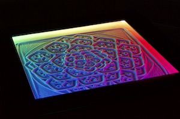

# Sand Table
  

### An open-source platform for building DIY sand tables (like the Sisyphus or ZenXY)
### Designed by Ravi Dudhagra ([@rdudhagra](https://github.com/rdudhagra))
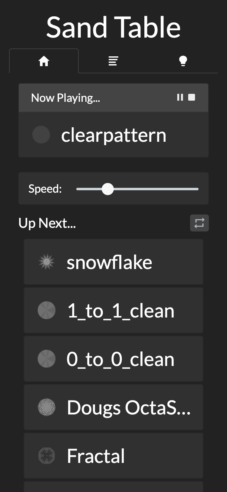

Inspired by Bruce Shapiro's [Sisyphus Tables](https://sisyphus-industries.com/), I created my own DIY sand table that uses a CoreXY system to create a square-shaped canvas, yet is still fully compatible with Sisyphus Table `.thr` files. 

The table is built out of half-inch plywood and some 1x8 pine boards, glued/nailed together, and painted glossy black. The CoreXY system is built out of OpenBuilds V-Slot rail and 3D-printed parts. Use of Trinamic's TMC2209 stepper drivers means quiet movement and sensor-less homing, further simplifying the electronics under the hood. The table can be controlled directly from your smartphone thanks to a webserver that runs on an onboard Raspberry Pi. This table makes an extremely fun and rewarding project that will last a lifetime, and should cost less than $750.

See the `Build Guide` folder for instructions on my specific build, or visit the other folders for direct access to the software. Check out the `discussions` tab for other helpful info/troubleshooting advice.

 

| | | |
| :---: | :---: | :---: |
| 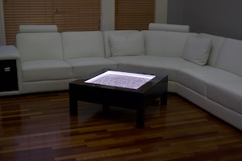 | 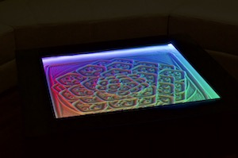 | 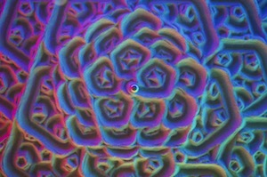 |
|  |  | 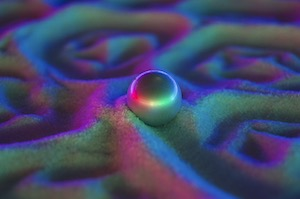 |
| 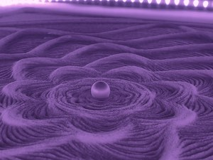 | 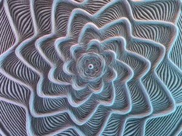 | 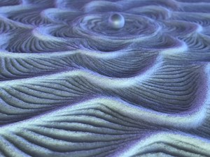 |
| 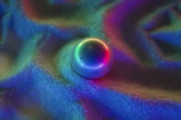 | 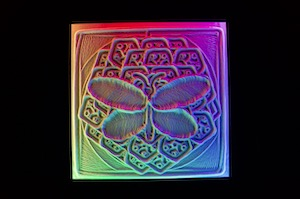 | 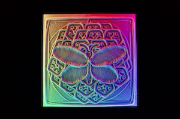 |
| 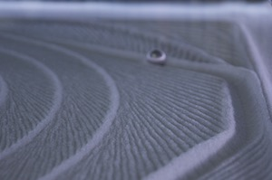 | 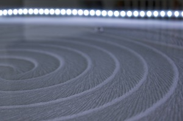 | 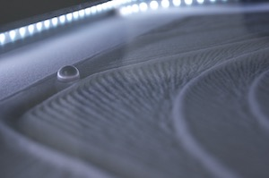 |
| 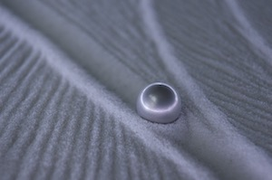 | 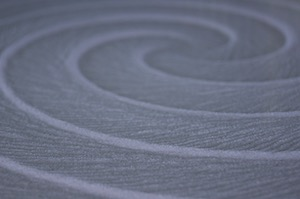 | 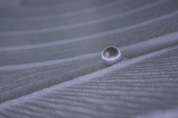 |
| 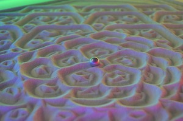 | 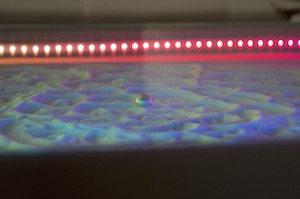 | 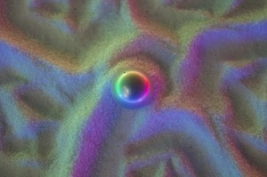 |
| 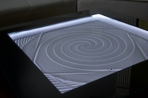 | 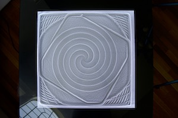 | 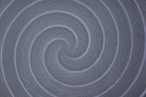 |
| 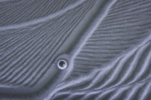 | 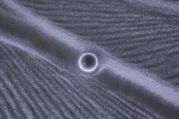 |  |
|  |  | 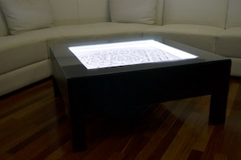 |
| 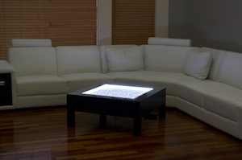 |  | 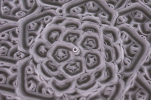 |
|  | 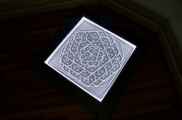 |  |

More pictures in the `images` folder...