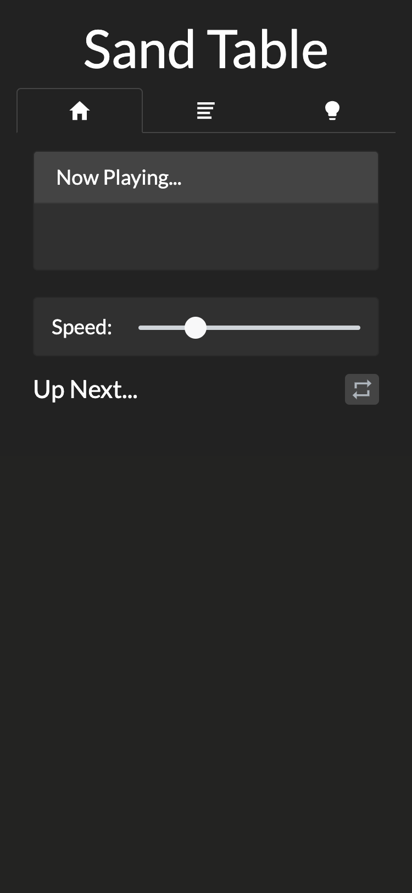
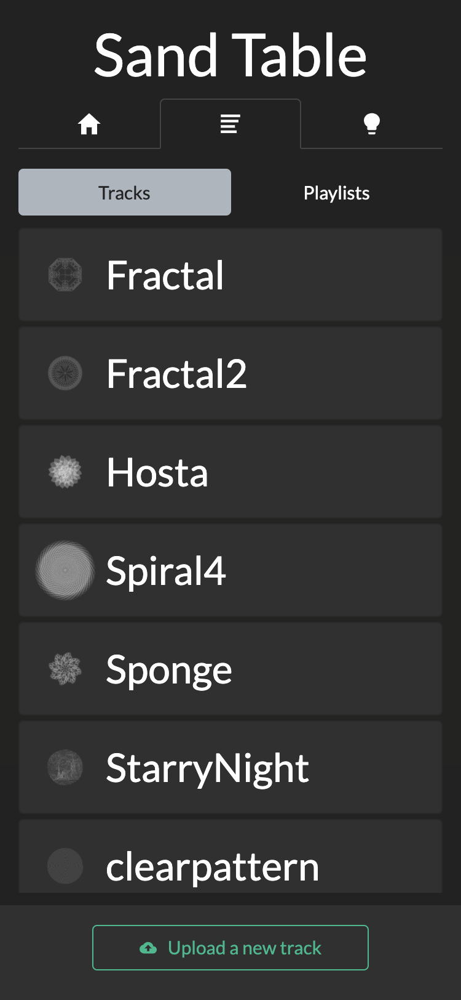
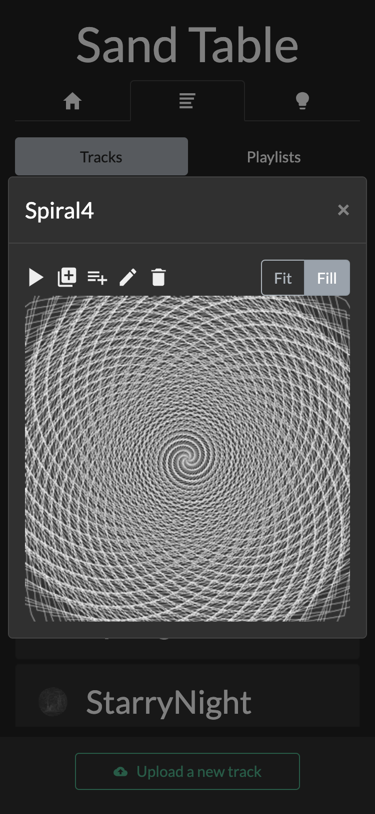
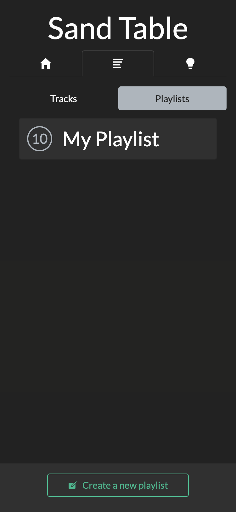
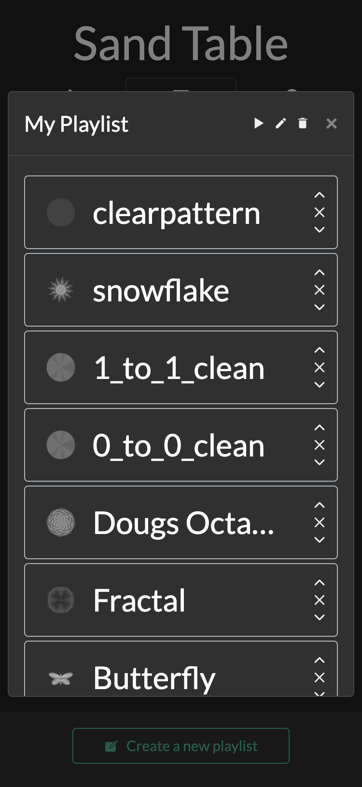
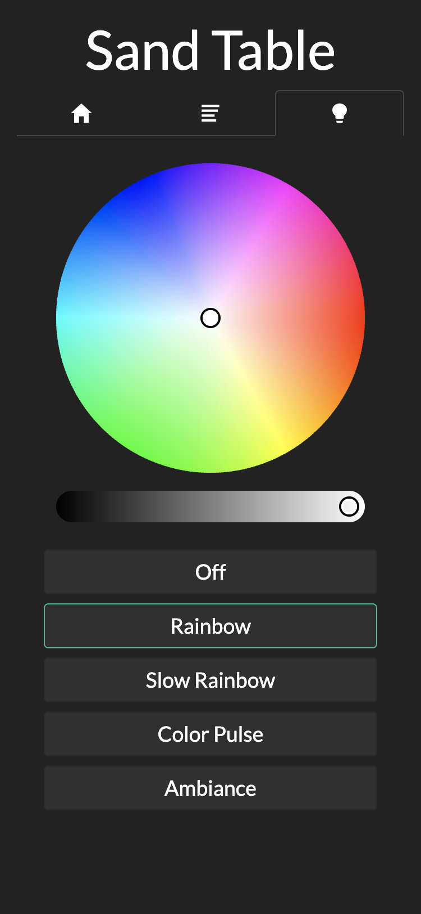

# Webserver
### A NodeJS webserver with ReactJS and Bootstrap for controlling your sand table remotely
### Designed by Ravi Dudhagra ([@rdudhagra](https://github.com/rdudhagra))

- [Installation Instructions](#installation-instructions)
  - [Prerequisites](#prerequisites)
  - [Building](#building)
  - [Screenshots](#screenshots)

# Installation Instructions

## Prerequisites
This project was developed with the following:
- `NodeJS v13.11.0`
- `NPM v6.14.5`

## Building
1. Download this folder to the directory of choice
2. In the same directory as `package.json`, run
   ```bash
   npm install # installs packages and dependencies
   ```
3. In the file `.env`, edit the parameters to match your setup

## Running the webserver
1. In the same directory as `package.json`, run
   ```bash
   npm run prod # compiles client and server files in production mode, and runs server
   ```
2. Visit `http://[ip address of machine]` in a web browser (runs on port 80)

If you want to run this webserver through systemd, the script `start.sh` should assist in this, assuming you're using NVM to manage Node versions.

## Running the webserver (development)
1. In the same directory as `package.json`, run
   ```bash
   npm start # compiles client files, compiles server files in memory, starts server with nodemon (restarts on file changes)
   ```
2. Visit `http://[ip address of machine]:3000` in a web browser (runs on port 3000)

## Screenshots








